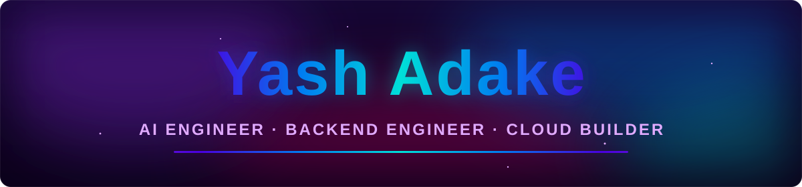

<!-- ══════════════════════════════════════════════════════════════
     Yash Adake · GitHub profile README · gradient v2
     One continuous color system: pink → purple → indigo → azure → cyan.
     Header/footer + section banners: capsule-render (verified live)
     Stats: github-readme-stats.zohan.tech (gradient mirror) ·
            streak-stats.demolab.com (gradient bg) ·
            github-profile-summary-cards (radical) · activity-graph (neon)
     Snake animation: .github/workflows/snake.yml — run it once from Actions!
     ══════════════════════════════════════════════════════════════ -->

<!-- Custom animated hero: the name itself is filled with a flowing pink→purple→cyan
     gradient + drifting aurora blobs — commit assets/hero-name.svg WITH this README.
     If you ever remove that file, fall back to this capsule-render banner instead:
     
-->


<div align="center">
  <a href="https://yashadake.com">
    
  </a>
</div>

<p align="center">
  
  <a href="https://yashadake.com">
    
  </a>
  <!-- The CONTACT badge points at the yashadake.com contact form — works for every
       visitor, needs no mail app, exposes no email address. To switch to direct
       email later, replace the href below with (fill in your address):
       mailto:YOUR-EMAIL?subject=Hey%20Yash%20%E2%80%94%20saw%20your%20profile%2C%20let%27s%20talk%20%F0%9F%9A%80&body=Hi%20Yash%2C%0D%0A%0D%0AI%20just%20came%20across%20your%20GitHub%20profile%20and%20your%20products%20%28OptiResume%2C%20MyJSON%2C%20AirDraw%29%20really%20caught%20my%20attention.%0D%0A%0D%0AI%27d%20love%20to%20connect%20about%3A%20%5Bcollaboration%20%2F%20opportunity%20%2F%20just%20saying%20hi%5D%0D%0A%0D%0ABest%2C%0D%0A%5BYour%20name%5D -->
  <a href="https://yashadake.com/#contact">
    
  </a>
</p>


##  Hey, I'm Yash

<p align="center">
  
  <samp>&nbsp;Most profiles list technologies. Mine runs in production.&nbsp;</samp>
  
</p>

```java
public final class YashAdake {

    String role =
        "AI Engineer • Backend Engineer • Cloud Builder";

    String mission =
        "Building production-ready AI products, automation platforms and scalable backend systems.";

    String[] building = {
        "AI SaaS",
        "AI Agents",
        "Developer Tools",
        "Automation Platforms"
    };

    String[] using = {
        "Python",
        "FastAPI",
        "Golang",
        "Docker",
        "Kubernetes",
        "PostgreSQL",
        "Redis",
        "Apache NiFi",
        "n8n",
        "REST APIs"
    };

    String[] ai = {
        "LLMs",
        "MCP",
        "RAG",
        "OpenAI",
        "Gemini",
        "Claude",
        "Vector Search",
        "Embeddings"
    };

    String[] engineering = {
        "Microservices",
        "System Design",
        "Performance Testing",
        "GitHub Actions",
        "GitLab CI/CD",
        "Linux",
        "Nginx",
        "Cloud Deployments"
    };

    String status() {
        return "Building products people actually use 🚀";
    }
}
```


<table>
  <tr>
    <td align="center" width="50%">
      <h3>🎯 OptiResume</h3>
      <p><em>AI resume analyzer that beats the ATS</em></p>
      <p>Hybrid AI engine — deterministic scoring rules + Gemini only for semantic analysis. Secure auth with refresh-token rotation. Resumes are parsed and discarded, never stored.</p>
      <p>
        
        
        
        
      </p>
      <a href="https://optiresume.in"><b>optiresume.in →</b></a>
    </td>
    <td align="center" width="50%">
      <h3>🧰 MyJSON</h3>
      <p><em>A premium JSON/YAML workstation in your browser</em></p>
      <p>Monaco-powered, keyboard-first developer tooling. 100% client-side — your data never leaves the tab. No telemetry, no network calls, no excuses.</p>
      <p>
        
        
        
      </p>
      <a href="https://myjson.yashadake.com"><b>myjson.yashadake.com →</b></a>
    </td>
  </tr>
  <tr>
    <td align="center" width="50%">
      <h3>✋ AirDraw</h3>
      <p><em>Draw in the air with your bare hands</em></p>
      <p>Real-time hand tracking in the browser: joint-angle finger detection, One-Euro pointer smoothing, gesture-switched tools. No server, no uploads — pure client-side CV.</p>
      <p>
        
        
        
      </p>
      <a href="https://airdraw.yashadake.com"><b>airdraw.yashadake.com →</b></a>
    </td>
    <td align="center" width="50%">
      <h3>🌐 yashadake.com</h3>
      <p><em>The parent brand — everything ships under one roof</em></p>
      <p>Hand-rolled HTML/CSS/JS portfolio with a Cloudflare Worker contact proxy. Vercel for apps, Cloudflare for DNS/SSL/CDN across every subdomain.</p>
      <p>
        
        
        
      </p>
      <a href="https://yashadake.com"><b>yashadake.com →</b></a>
    </td>
  </tr>
</table>


<div align="center">

**Languages**


**Backend & AI**


**Frontend**


**Data**


**DevOps & Cloud**


</div>


<div align="center">
  
</div>

<div align="center">
  
  
</div>

<div align="center">
  
  
  
</div>

<br/>


<!-- Generated by .github/workflows/snake.yml — go to the repo's Actions tab →
     "Generate contribution snake" → "Run workflow" once to create the output
     branch. Until then this shows a broken image. -->
<picture>
  <source media="(prefers-color-scheme: dark)" srcset="https://raw.githubusercontent.com/YashAdake/YashAdake/output/github-snake-dark.svg" />
  <source media="(prefers-color-scheme: light)" srcset="https://raw.githubusercontent.com/YashAdake/YashAdake/output/github-snake.svg" />
  
</picture>


<p align="center">
  <a href="https://www.linkedin.com/in/yash-adake/">
    
  </a>
  <a href="https://x.com/yash_adake">
    
  </a>
  <a href="https://www.instagram.com/yash_adake">
    
  </a>
  <a href="https://discord.com/users/yashadake">
    
  </a>
</p>

<div align="center">
  
</div>


